> Computer Science & Cyber Security student building security tools, full-stack apps, and occasionally questionable amounts of SVG.

## projects

- <samp>XEROVA</samp> — threat intelligence and cybersecurity investigation platform
- <samp>Zline</samp> — end-to-end encrypted chat application
- <samp>BALLON</samp> — football transfer intelligence and valuation engine
- <samp>Nyota OS</samp> — hobby operating-system project

## stack

<samp>TypeScript · React · Next.js · Python · FastAPI · MongoDB · Linux · Cybersecurity</samp>

## activity

<samp>generated automatically from this repository · no external stats widgets</samp>

