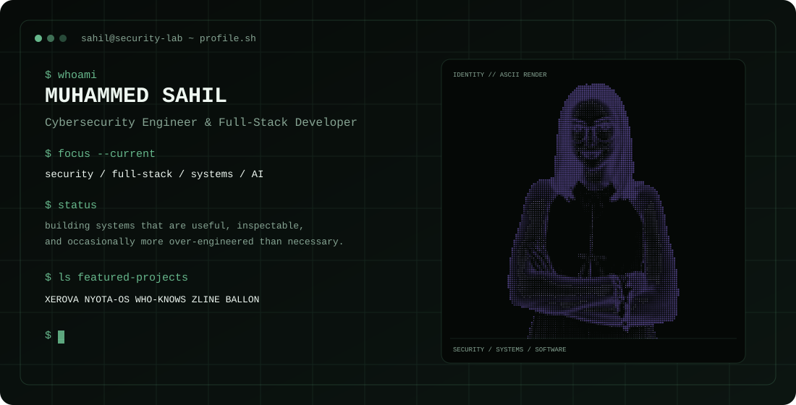
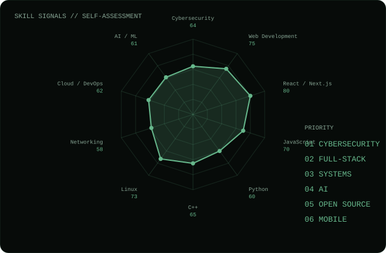

<div align="center">



<br>

<a href="https://github.com/mhdsahil1"></a>
<a href="https://www.linkedin.com/in/mhdsahil09/"></a>
<a href="https://mhdsahil.vercel.app/"></a>
<a href="https://www.instagram.com/s4hilzzz_/"></a>

<br><br>

<samp>SECURITY · FULL-STACK · SYSTEMS · AI</samp>

</div>

---

## about

I'm **Muhammed Sahil**, a Computer Science & Cybersecurity student and developer interested in building software that is useful, inspectable, and occasionally more over-engineered than necessary.

My work sits across **cybersecurity, full-stack development, systems programming, AI, and open-source tooling**.

- Building security-focused applications and threat intelligence workflows
- Developing full-stack products with React, Next.js, TypeScript, Python, and MongoDB
- Exploring low-level systems through **Nyota OS**
- Building practical tools rather than collecting technologies for the sake of a skill list

---

## stack

<div align="center">


<br><br>

<samp>
CYBERSECURITY · NETWORKING · THREAT INTELLIGENCE · SYSTEMS · FULL-STACK · MOBILE
</samp>

</div>

---

## projects

### [XEROVA](https://github.com/mhdsahil1/Xerova)

**Cybersecurity Intelligence Platform**

A security-focused platform for threat intelligence and investigation workflows, bringing IOC analysis and external intelligence sources into a centralized interface.

`Next.js` `React` `TypeScript` `MongoDB` `VirusTotal` `AbuseIPDB` `Shodan`

**Live:** [xerova](https://xerova-lab.vercel.app/)

---

### [Nyota OS](https://github.com/mhdsahil1/Nyota-OS)

**Hobby Operating System**

A low-level operating-system project built from the boot process upward, exploring x86 architecture, bootloaders, assembly, C, linking, and emulation.

`C` `x86` `NASM` `GCC` `GNU ld` `QEMU` `Linux`

---

### [Who Knows!](https://github.com/mhdsahil1/Who_Knows)

**Mobile-First Social Deduction Game**

A local pass-and-play imposter game built with Flutter, featuring configurable game modes, word sources, imposter settings, final-guess mechanics, and support for larger groups.

`Flutter` `Dart` `Android` `Web`

---

### [Zline](https://github.com/mhdsahil1/Zline)

**End-to-End Encrypted Chat**

A real-time communication application focused on private messaging, media, reactions, editing, deletion, and encrypted communication infrastructure.

`Next.js` `React` `TypeScript` `MongoDB` `Socket.IO` `Cryptography`

**Live:** [Zline](https://zline.vercel.app/)

---

### BALLON

**Football Transfer Intelligence & Valuation Engine**

A collaborative project combining football data, a valuation engine, a Python backend, and a modern web frontend to explore player valuation and transfer intelligence.

`Python` `FastAPI` `Next.js` `Machine Learning`

---

<div align="center">



</div>

---

## github signals

<div align="center">


<br>


<br>


</div>

---

## currently

```text
focus/
├── cybersecurity
├── full-stack development
├── systems
└── AI

building/
├── XEROVA
├── Nyota OS
├── Who Knows!
└── other experiments

principles/
├── build real things
├── understand the stack
└── ship before polishing forever
```

---

<div align="center">

<samp>built with code, curiosity, and an unreasonable number of terminal windows.</samp>

<br><br>

<a href="mailto:sahilmuhammed112@gmail.com">sahilmuhammed112@gmail.com</a>

</div>
