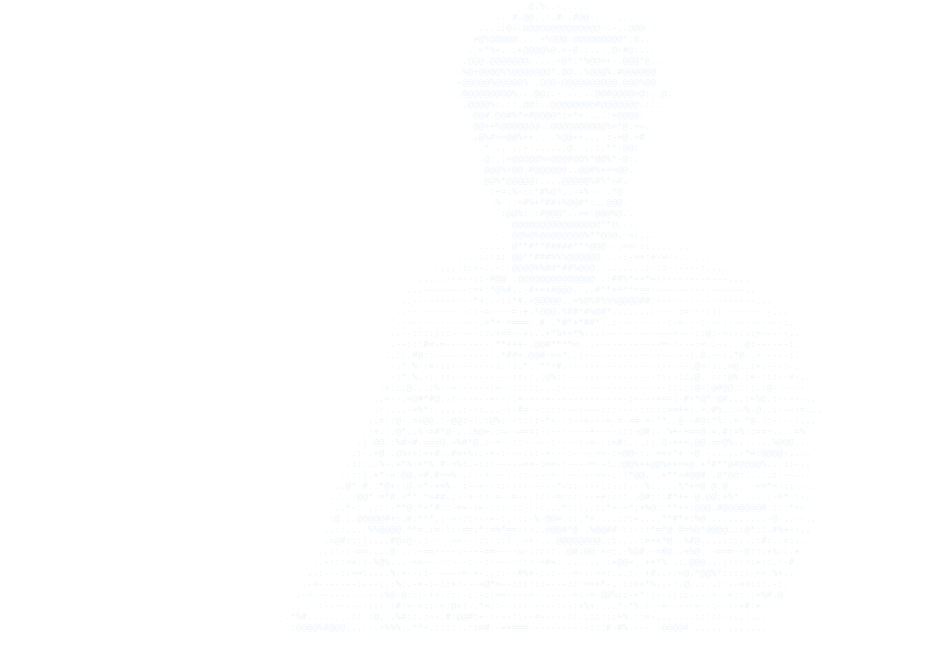
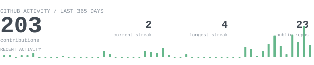
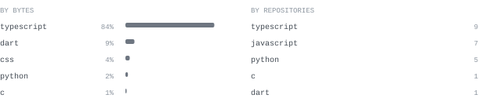
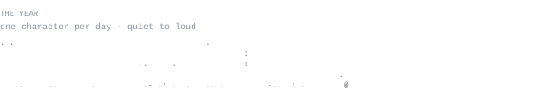

[github.com/mhdsahil1](https://github.com/mhdsahil1) &nbsp;·&nbsp;
[linkedin](https://www.linkedin.com/in/mhdsahil09/) &nbsp;·&nbsp;
[portfolio](https://v0-sahil-dev.vercel.app/)

> B.Tech Computer Science & Cyber Security student from Mangalore, building security tools and full-stack applications.
> 
> I like systems that are useful, inspectable, and slightly over-engineered when the alternative is boring.

Right now I'm working across cybersecurity, full-stack development, threat intelligence, and the occasional low-level experiment. The current collection includes **XEROVA**, **Zline**, **BALLON**, and **Nyota OS**.

<samp>typescript &nbsp; javascript &nbsp; react &nbsp; next.js &nbsp; python &nbsp; fastapi &nbsp; mongodb &nbsp; linux &nbsp; git &nbsp; cybersecurity</samp>

**[XEROVA](https://xerova-lab.vercel.app/)** &nbsp;·&nbsp; <samp>next.js, react, typescript, mongodb</samp> 
Threat intelligence and cybersecurity investigation platform integrating IOC analysis, reputation sources, and security intelligence workflows.

**Zline** &nbsp;·&nbsp; <samp>next.js, mongodb, socket.io, cryptography</samp> 
End-to-end encrypted chat application with messaging, media, reactions, editing, deletion, and real-time calling infrastructure.

**BALLON** &nbsp;·&nbsp; <samp>python, fastapi, next.js, machine learning</samp> 
Football transfer intelligence and player valuation engine combining football data with a valuation model.

**Nyota OS** &nbsp;·&nbsp; <samp>c, x86, nasm, qemu, linux</samp> 
A hobby operating-system project built from the boot sector upward, because apparently writing software that already exists wasn't sufficiently difficult.

Every graphic here is generated locally in this repository. The contribution, streak, language, yearly activity, and ASCII portrait graphics are generated from the GitHub GraphQL API or the supplied portrait source by a scheduled GitHub Action.

The graphics are SVGs so the README does not depend on an external stats-card service. They use SVG-native rendering rather than JavaScript, since GitHub strips scripts from rendered README content.

The ASCII portrait is stored as a separate file so GitHub cannot keep serving the previous portrait asset from its cache. The workflow commits only generated files when their contents actually change.

Language totals are calculated from public, non-fork repositories owned by this account.
